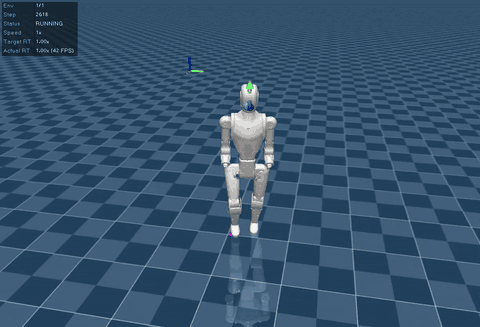

# Asimov-1 Walking Policy Training: Technical Report

A record of building a bipedal walking (velocity-tracking) policy training pipeline for Asimov-1 with mjlab. Work dates: 2026-09-21 to 22.

- Target: `sim-model/xmls/asimov_1.xml` (MuJoCo MJCF)
- Task ID: `Asimov-Velocity-Flat` (velocity-command tracking on flat ground), `Asimov-Velocity-Stairs` (stair climbing, §5)
- Implementation: `training/` (the same directory as this document)



## Table of Contents

1. [Analysis of the Simulation Environment](#1-analysis-of-the-simulation-environment)
2. [Walking Policy Training: Approach and Experimental Results](#2-walking-policy-training-approach-and-experimental-results)
3. [Using the Scripts](#3-using-the-scripts)
4. [Known Limitations and Future Work](#4-known-limitations-and-future-work)
5. [Stair-Climbing Task (Asimov-Velocity-Stairs)](#5-stair-climbing-task-asimov-velocity-stairs)
6. [Redesigning Observations/Rewards with a climbing_mode Flag](#6-redesigning-observationsrewards-with-a-climbing_mode-flag)

---

## 1. Analysis of the Simulation Environment

### 1.1 Software environment

| Item | Details |
|---|---|
| Training framework | mjlab 1.6.0 (MuJoCo Warp + an Isaac Lab-style manager-based API) |
| Physics engine | mujoco 3.11.0 / mujoco-warp 3.11.0 (pinned by mjlab to `~=3.11.0`) |
| RL library | rsl-rl-lib 5.4.2 (PPO; pinned by mjlab; rsl_rl is the only library mjlab integrates with) |
| Deep learning | torch 2.11.0+cu128 |
| Logging | wandb 0.28.2 (restricted to `<0.29`; see §3.5) |
| Python | 3.12 |
| GPU | NVIDIA RTX 5060 Ti (16 GB, Blackwell / sm_120). A torch build for CUDA 12.8 is required, so the `pytorch-cu128` index is specified |

### 1.2 Structure of the MJCF (`sim-model/xmls/asimov_1.xml`)

| Item | Details |
|---|---|
| Root | `freejoint` on `pelvis_link` (floating base). Initial position z = 0.630 m |
| Joints | 23 hinges. Legs: 12 (left/right × hip pitch/roll/yaw, knee, ankle pitch/roll). Arms: 10 (left/right × shoulder pitch/roll/yaw, elbow, wrist yaw). Waist: 1 (waist yaw) |
| Bodies | 25 (pelvis + 12 leg + waist + 2 neck + 10 arm) |
| Actuators | **None** (`sim-model/README.md` states they are defined in the training-side Python) |
| Keyframes | **None** |
| Sensors | On the `imu_in_pelvis` site: `imu_ang_vel` (gyro), `imu_lin_vel` (velocimeter), `imu_lin_acc`, `imu_quat`, `root_angmom` (subtreeangmom). No joint sensors and no foot force sensors |
| Foot contact | 4 spheres per foot (radius 5 mm, `foot_capsule` class, `condim=3`, `friction=0.6`) + `left_foot` / `right_foot` sites |
| Other collisions | The `collision` class has `condim=6`, `priority=1`. 24 adjacent-body pairs are excluded via `<contact><exclude>` |
| Physics options | `<option>` is commented as "for the standalone viewer"; the training side is expected to set them |
| Neck | `neck_yaw_link` / `neck_pitch_link` are meshes only and have **no joints** (the README's "2-DOF neck" is not reflected in the MJCF) |
| `passive_upper` class | `damping=15, stiffness=80, springref=0`. Defined, but **no joint uses it** |

The sensor names (`imu_lin_vel`, `imu_ang_vel`, `root_angmom`) and the foot naming (`{left,right}_foot{1..}_collision`, `left_foot`, `*_ankle_roll_link`) follow the same conventions as the Unitree G1 configuration bundled with mjlab. The MJCF appears to have been built to be used with mjlab's templates.

### 1.3 Joint properties

**Armature (reflected rotor inertia) and range of motion** (all values from the MJCF):

| Joint | armature | Range [rad] |
|---|---|---|
| hip pitch | 0.095625 | -2.09 to 1.0 (right side has the axis reversed: -1.0 to 2.09) |
| hip roll | 0.11 | ±0.785 |
| hip yaw | 0.038 | ±0.785 |
| knee | 0.0339552 | 0 to 1.5 (right: -1.5 to 0) |
| ankle pitch | 0.0565056 | ±0.35 |
| ankle roll | 0.0565056 | ±0.1 |

**Torque and velocity limits** (not in the MJCF, so taken from `sim-model/urdf/asimov_1.urdf`; identical left and right):

| Joint | effort [Nm] | velocity [rad/s] |
|---|---|---|
| hip pitch | 45 | 12.57 |
| hip roll | 45 | 3.98 |
| hip yaw | 28 | 5.45 |
| knee | 45 | 12.25 |
| ankle pitch | 40 | 9.32 |
| ankle roll | 17 | 9.32 |

**MJCF properties that caused problems during implementation**

1. **Joint axes are reversed between left and right**: left hip pitch / knee / ankle pitch use axis +y, the right side uses -y. The same physical motion therefore has opposite joint-value signs on the two sides (e.g., knee flexion is +a on the left and -a on the right). Configuring both sides at once with a regular expression puts the right knee outside its range.
2. **`ref` on the elbows**: only the left and right elbows have `ref=±0.785398` (all others are 0). The CAD arm pose corresponds to qpos = ref. Using `passive_upper`'s `springref=0` as is would place the rest angle at the edge of the joint range, so the elbows use `springref=ref`.
3. **Ground plane and lights inside the MJCF**: the MJCF has its own `floor` plane and lights. In mjlab the scene's terrain provides the ground; leaving it in would duplicate the plane and double the foot contacts. It is removed in `get_spec()` (the MJCF file itself is not modified).
4. **`stiffness` / `damping` of `MjsJoint` are 3-element arrays** (in this MuJoCo version). Only the linear term is used.

### 1.4 Standing verification (`training/scripts/check_standing.py`)

- With all leg joints at 0 (straight), the soles are at world z ≈ 0.005 m (leg length ≈ 0.625 m). However, the knees are at the edge of their range in a singular configuration, so this cannot be used as the initial pose for training.
- Applying PD control alone with zero input cannot keep the robot standing (it falls in about 1.5 s). As expected, the ankle kp = 65 Nm/rad is below the stiffness needed to support a 35 kg inverted pendulum passively (roughly mgh ≈ 170 Nm/rad). Balancing is the policy's job.
- The initial pose was chosen by aligning the whole-body center of mass with the center of the support region. Because the upper-body mass sits behind the hip joints, the CoM projects about 3 cm behind the center of the feet when the trunk is upright. A grid search (CoM within ±6 mm of the foot center, knee ≥ 0.3 rad, minimal ankle angle) gave the following pose.

| Item | Value (left side; the right side has the sign reversed) |
|---|---|
| hip pitch | -0.25 rad (thigh forward) |
| knee | +0.30 rad |
| ankle pitch | -0.17 rad (keeps the sole level) |
| Trunk (pelvis) forward lean | 0.12 rad (about 7°) |
| Pelvis height | 0.62 m (height at which the feet touch the ground, 0.6171 m, plus a few mm) |
| Elbow | value of `ref` (±0.785) |

### 1.5 Correspondence with the Menlo walking guide

Reference: <https://docs.menlo.ai/guides/locomotion-training>

- Matches: 12 leg joints, joint naming, armature values (hip pitch 0.095625, knee 0.0339552, ankle 0.0565056). We therefore judged that the guide's numbers apply to this MJCF.
- Differences (treated as **out of scope** this time; the MJCF was used as is):
  - The guide describes the ankle as an **RSU parallel-link mechanism** (2 motors) and the leg as **7 DOF (with a passive toe joint)**, whereas the MJCF models ankle pitch / roll as independent simple hinges and has no toe. Mixing of motors A/B is left as a future firmware / deployment-layer task.
  - Some numbers in the guide, such as the effective ankle torque limit, do not match the URDF values.
  - The Locomotion / API pages of `manual.asimov.inc` could not be reached at the time of the survey (HTTP 522).

---

## 2. Walking Policy Training: Approach and Experimental Results

### 2.1 Approach (decisions)

1. **The action space is the 12 leg DOF only.** Arms, waist, and neck are outside the policy.
2. Ankle and toe: use the **current MJCF as is** (no RSU link or passive toe added).
3. Actuators are **mjlab's standard PD position actuators** (`BuiltinPositionActuatorCfg`). No detailed motor model is used.
4. Use mjlab's bundled **velocity task as the template**, following the G1 configuration's "create, then override" pattern (`make_velocity_env_cfg()`). The plan was to build `ManagerBasedRlEnvCfg` directly if overriding proved difficult, but that was not necessary.

### 2.2 Robot definition (`training/src/mjlab_asimov/robot/asimov_constants.py`)

- **12 leg joints**: PD position actuators. kp = 65, kd = 5 (the values in the Menlo guide's system identification), and per-joint effort limits from the URDF. Actuator command latency is 0–1 physics steps (the guide's `delay_min_lag=0, delay_max_lag=1`). Soft joint limits are 0.9× the range.
- **11 joints = 10 arm + 1 waist**: no actuators. Held by MuJoCo's native joint spring-damper (stiffness 80 / damping 15, the same values as the `passive_upper` class). They are excluded from both the policy's action space and its observations.
- **Action scale**: per joint, `0.30 × effort_limit / stiffness` (Menlo). 0.208 for hip pitch / roll and knee, 0.129 for hip yaw, 0.185 for ankle pitch, 0.078 for ankle roll.
- **Collision**: with `CollisionCfg`, the feet use `condim=3, friction=0.6, priority=1`, and all other collision capsules use `condim=1, priority=0` (the MJCF's `condim=6` is excessive for links that are not expected to touch the ground).

### 2.3 Environment configuration (`training/src/mjlab_asimov/tasks/asimov_velocity_env_cfg.py`)

| Item | Setting |
|---|---|
| Physics / policy rate | 200 Hz / 50 Hz (timestep 0.005 s, decimation 4). Episode length 20 s |
| Terrain | Flat (`plane`). Terrain scan and terrain curriculum removed |
| Commands | Fixed ranges (no curriculum). vx ∈ [-0.8, 0.8] m/s, vy ∈ [-0.6, 0.6] m/s, wz ∈ [-0.6, 0.6] rad/s. The template's 10% standing, 30% heading, and 20% forward-only environments are kept |
| Terminations | 20 s timeout; tilt of 70° or more (`fell_over`) |

**Observations (asymmetric actor-critic)**

| Group | Contents | Dim. |
|---|---|---|
| actor | base angular velocity (3), projected gravity (3), velocity command (3), leg joint positions (12), leg joint velocities (12), previous action (12) | 45 |
| critic | the actor terms + base linear velocity (privileged), foot height, air time, contact, contact force | 60 |

- The actor does not receive the base linear velocity (the real robot cannot measure it). This matches the Menlo guide's actor input (45 dimensions).
- Noise follows Menlo: angular velocity ±0.01, projected gravity ±0.05, joint position ±0.01 rad, joint velocity ±0.1 rad/s.
- An observation delay of 0–1 steps was added to joint positions and velocities. The guide uses three tiers (0–2 / 0–1 / 0) according to the CAN polling order, but since Asimov-1's hardware configuration is unknown, a uniform 0–1 was used as a placeholder.

**Domain randomization** (Menlo's policy: randomize only quantities that actually differ between the real robot and the simulation)

| Item | Range |
|---|---|
| Encoder offset | ±0.02 rad (startup) |
| PD gains (kp, kd) | ×0.9 to ×1.1 (reset) |
| Foot friction | 1.0 to 1.5 (startup, foot geoms only) |
| Push disturbance | ±0.5 m/s horizontally, every 4–8 s |
| Actuator delay | 0–1 physics steps |
| **Not randomized** | Mass, link lengths, gravity (the guide states this reduces stability). The template's `base_com` is also removed |

**Rewards (final values)**

| Term | Weight | What it evaluates |
|---|---|---|
| `track_linear_velocity` | +2.0 | Tracking of the xy velocity command (exponential kernel, std = √0.25) |
| `track_angular_velocity` | +2.0 | Tracking of the yaw rate command (std = √0.5) |
| `upright` | +1.0 | Rewards the pelvis orientation being close to upright |
| `pose` | +1.0 | Deviation from the home pose: `exp(-mean(err²/std²))`. Walking std values are in the table below |
| `air_time` | +0.5 | Every step, rewards the number of feet (0–2) whose air time is in the 0.05–0.5 s range. It does not look at height. Only when the command is large |
| `foot_swing_height` | -2.0 | **Only at the moment of touchdown**, penalizes how far the peak height of the swing deviates from the 0.1 m target, `(peak/0.1 - 1)²` |
| `foot_clearance` | -2.0 | Penalizes each foot's `|foot height - 0.1 m| × horizontal foot speed` (moving feet only) |
| `foot_slip` | -0.1 | Squared horizontal speed of a foot while in contact |
| `body_ang_vel` | -0.08 | Pelvis roll / pitch angular velocity (Menlo) |
| `angular_momentum` | -0.03 | Whole-body angular momentum (Menlo; uses the MJCF's `root_angmom`) |
| `dof_pos_limits` | -1.0 | Leg joints exceeding their soft limits |
| `action_rate_l2` | -0.03 | Change in the action |
| `torques` | -5e-5 | Squared joint torque |
| `soft_landing` | -1e-5 | Impact force at touchdown |
| `self_collisions` | -1.0 | Self-collision (force of 10 N or more) |

Walking std of `pose` (rad):

| Joint | Value | Note |
|---|---|---|
| hip pitch | 0.6 | 2× G1's 0.3 |
| knee | 0.7 | 2× G1's 0.35 |
| ankle pitch | 0.5 | 2× G1's 0.25 |
| hip roll / hip yaw | 0.15 | Same as G1 |
| ankle roll | 0.1 | Same as G1 |

While standing (`std_standing`), all joints use 0.05.

**PPO (rsl_rl)**: actor and critic are both MLPs `512 → 256 → 128` (ELU, with observation normalization). Learning rate 1e-3 (adaptive, target KL 0.01), clip 0.2, gamma 0.99, lambda 0.95, entropy coefficient 0.01, 5 epochs × 4 mini-batches, `num_steps_per_env=24`. 1500 iterations (about 15 minutes on an RTX 5060 Ti with 4096 environments, about 160,000 steps/s).

### 2.4 Course of the experiments

**First training run (baseline)**: trained for 1500 iterations with the template's rewards (equivalent to G1) adjusted for Asimov-1.

- 0 falls; episode length reached the upper limit of 1000 steps.
- Tracking was about 80–88% of the command. It does not step in place under a stop command; when moving, the left and right feet make ground contact at nearly the same frequency (about 1.7 Hz), and the time with both feet in the air is 0 (no hopping).
- **Problem**: the foot lift is small (a shuffling gait). This was confirmed both visually and by the training log's `Metrics/peak_height_mean` (about 3.4 cm against the 10 cm target).

**Hypothesis about the cause**: `air_time` was disabled (weight 0), so nothing rewarded having a foot in the air. Only two penalties encourage lifting, and in particular `foot_swing_height` acts only at touchdown with an upper bound of 0.25 per event; since touchdowns occur about 0.07 times per step, it amounts to at most about 0.02 per step (about 1% of the tracking reward). Meanwhile, the cost of lifting the foot was large: in the training log, `torques` -0.184, `action_rate_l2` -0.379, and `pose` 0.82 / 1.0 were all larger than `foot_clearance` (-0.104).

**Experiments**: four cumulative experiments, changing one thing at a time (1500 iterations each, identical settings, one seed).

| Experiment | Change (added to the previous one) |
|---|---|
| E1 | `foot_swing_height` from -0.25 to -2.0 |
| E2 | `air_time` from 0 to 0.5 |
| E3 | `torques` from -2e-4 to -5e-5, `action_rate_l2` from -0.1 to -0.03 (two changes at once) |
| E4 | `pose` std doubled for hip pitch / knee / ankle pitch (0.3/0.35/0.25 → 0.6/0.7/0.5) |

### 2.5 Evaluation results

Evaluation method (`training/scripts/eval_policy.py`): fixed velocity commands, 64 environments × 8 seconds (the first second excluded). No noise, no push disturbances, no domain randomization. The swing peak height is the height of the foot site above the ground (sensor value), averaged per touchdown.

**Swing peak height [cm]**

| Command | Baseline | E1 | E2 | E3 | **E4** |
|---|---|---|---|---|---|
| Forward 0.4 m/s | 2.9 | 3.5 | 3.5 | 3.5 | **6.8** |
| Forward 0.8 m/s | 5.4 | 6.0 | 6.7 | 6.7 | **10.8** |
| Backward -0.4 m/s | 3.0 | 4.0 | 3.7 | 3.2 | 5.2 |
| Lateral 0.4 m/s | 2.2 | 3.3 | 3.1 | 2.9 | 5.4 |
| Turn 0.5 rad/s | 1.8 | 2.8 | 2.4 | 2.4 | 4.6 |

**Measured command tracking** (command → measured. Turning is wz [rad/s]; the others are velocities [m/s])

| Command | Baseline | E1 | E2 | E3 | **E4** |
|---|---|---|---|---|---|
| Forward 0.4 | 0.33 | 0.33 | 0.34 | 0.36 | **0.37** |
| Forward 0.8 | 0.69 | 0.69 | 0.70 | 0.71 | **0.74** |
| Backward -0.4 | -0.32 | -0.33 | -0.34 | -0.34 | -0.34 |
| Lateral 0.4 | 0.30 | 0.34 | 0.31 | 0.32 | 0.31 |
| Turn 0.5 | 0.40 | 0.30 | 0.48 | 0.45 | 0.48 |

**Fraction of time both feet are on the ground** (forward 0.4 / 0.8)

| Baseline | E1 | E2 | E3 | E4 |
|---|---|---|---|---|
| 0.45 / 0.28 | 0.52 / 0.31 | 0.26 / 0.15 | 0.19 / 0.11 | 0.16 / 0.07 |

- 0 falls in every condition and every experiment, and the fraction of time both feet are in the air is 0 (no hopping).
- The training log's `fell_over` (with push disturbances and noise) was 0.0 for the baseline, 0.125 for E1, 0.042 for E2, 0.0 for E3, and 0.083 for E4 (last-iteration values; normalization follows mjlab's definition).

### 2.6 Discussion

- **The main reason the feet did not lift was the `pose` reward.** In E1–E3 (8× the swing penalty, adding `air_time`, lowering the torque and action-change penalties), the height at forward 0.4 m/s stayed at 3.5 cm (forward 0.8 also stayed within 6.0–6.7 cm); changing the reward weights did not improve it. Only E4, which widened the `pose` tolerance, reached 6.8 / 10.8 cm.
- Diagnosis (E3 policy, forward 0.4 m/s): the knee flexes a lot, 0.14 to 0.90 rad, but the hip pitch swing is only 0.28 rad, so there is little motion swinging the thigh forward. Torque utilization is at most about 0.65 (hip roll) and about 0.1 for hip pitch, leaving ample margin, and there is no action clipping, so neither torque nor the action range is the cause. The `pose` reward (weight 1.0; while walking, a 0.6 rad knee movement with std 0.35 is penalized heavily) can be interpreted as having suppressed the hip and knee motion.
- The effects of E1–E3 are **single-run, single-seed results, and differences under 1 cm are not significant**. However, adding `air_time` (E2) greatly reduced the fraction of time on the ground and improved turning tracking from 0.30 to 0.48 rad/s. E3 slightly improved tracking. Since none of these hurt the gait, they were kept in the configuration and became the basis for E4.
- At forward 0.8 m/s, E4 reaches 10.8 cm, slightly above the 0.1 m target. If this is too high, the target height can be adjusted.

### 2.7 Current settings and the relationship to E1–E4

All settings from E1–E4 are already incorporated in `asimov_velocity_env_cfg.py`, and the current defaults are E4. To reproduce the baseline, override the following on the CLI, and set `walking_std` in the same file back to (0.3, 0.15, 0.15, 0.35, 0.25, 0.1).

```bash
uv run asimov-train Asimov-Velocity-Flat \
  --env.rewards.foot-swing-height.weight -0.25 \
  --env.rewards.air-time.weight 0.0 \
  --env.rewards.torques.weight -2e-4 \
  --env.rewards.action-rate-l2.weight -0.1
```

---

## 3. Using the Scripts

Run everything from the repository root.

**Environment setup (first time only; required before running training)**

```bash
# 1. Install the dependencies
uv sync

# 2. Log in to wandb (training logs are sent to wandb, so do this before training)
uv run wandb login
```

Training logs are sent to wandb by default, so complete `wandb login` before starting training. If you do not use wandb, specify `--agent.logger tensorboard` when training and `wandb login` is not needed (§3.5).

This section covers usage common to both tasks (using the flat task `Asimov-Velocity-Flat` as the example). Commands and scripts specific to the stairs task `Asimov-Velocity-Stairs` are collected in §5.7.

### 3.1 File layout

```
training/
├── TECHNICAL_REPORT.md                       Japanese version
├── TECHNICAL_REPORT_en.md                    This document (English version)
├── src/mjlab_asimov/
│   ├── robot/asimov_constants.py             Robot definition (actuators, initial pose, collision)
│   ├── tasks/__init__.py                     Task registration (both Flat and Stairs)
│   ├── tasks/asimov_velocity_env_cfg.py      Flat task environment config (observations, rewards, DR, commands)
│   ├── tasks/asimov_rl_cfg.py                Flat task PPO / logger config
│   ├── tasks/asimov_stairs_terrain.py        Stairs terrain (ascent-only, §5.1)
│   ├── tasks/asimov_stairs_env_cfg.py        Stairs task environment config (§5.2)
│   ├── tasks/asimov_stairs_rl_cfg.py         Stairs task PPO / logger config
│   └── scripts/
│       ├── train_cli.py                      Implementation of asimov-train / asimov-play
│       └── play_keyboard.py                  Implementation of asimov-play-keyboard
├── scripts/
│   ├── check_standing.py                     Check of the initial pose / model build (CPU)
│   ├── eval_policy.py                        Numerical evaluation with fixed commands (shared by both tasks)
│   └── diagnose_gait.py                      Per-terrain-type gait diagnostic for the stairs task (§5.4)
└── tests/                                    Static tests (no GPU needed, 23 tests)
```

Commands in the root `pyproject.toml`: `asimov-train`, `asimov-play`, `asimov-play-keyboard`. mjlab's standard `train` / `play` only discover the tasks bundled with mjlab, so `asimov-*` are wrappers that register the task first and then call mjlab's own entry points.

### 3.2 Training

```bash
uv run asimov-train Asimov-Velocity-Flat --env.scene.num-envs 4096 --agent.run-name <experiment-name>
```

| Option | Description |
|---|---|
| `--env.scene.num-envs N` | Number of parallel environments. About 160,000 steps/s with 4096 (RTX 5060 Ti), about 80,000 steps/s with 1024 |
| `--agent.max-iterations N` | Number of iterations (default 10000). 1500 takes about 15 minutes (RTX 5060 Ti, 4096 environments) |
| `--agent.run-name NAME` | Display name of the run. Appended to the log directory name and used as the wandb run name |
| `--agent.logger {wandb,tensorboard}` | Log destination (default: wandb) |
| `--env.rewards.<term>.weight X` | Override a reward weight (e.g., `--env.rewards.foot-swing-height.weight -1.0`). Use `-` in place of `_` in term names |
| `--env.rewards.<term>.params.<key> X` | Override a reward parameter (e.g., `...foot-swing-height.params.target-height 0.08`) |
| `--agent.upload-model False` | Stop uploading checkpoints to wandb |
| `--help` | Show all options (rewards, events, and PPO settings can also be overridden from the CLI) |

Output:

- Logs and checkpoints: `logs/rsl_rl/asimov1_velocity/<datetime>_<experiment-name>/` (already in `.gitignore`). `model_<iter>.pt` is saved every 50 iterations, and an ONNX file (`*.onnx`) is also written at each save.
- Progress is printed to standard output (`Mean reward`, `Mean episode length`, each reward term, `Metrics/peak_height_mean`, etc.).

### 3.3 Playback

**mjlab's standard viewer** (commands are random; the viewer controls are mjlab's standard ones)

```bash
uv run asimov-play Asimov-Velocity-Flat --checkpoint-file logs/rsl_rl/asimov1_velocity/<run>/model_1499.pt --num-envs 1
```

If `DISPLAY` is set, it opens the native MuJoCo viewer; otherwise it opens the browser (viser) viewer (selectable with `--viewer native|viser`). The viewer shows command arrows (green = target, blue = measured). To fetch a checkpoint from wandb, use `--wandb-run-path <entity>/asimov1-locomotion/<run_id>`.

**Controlling the command with the keyboard**

```bash
uv run asimov-play-keyboard --checkpoint logs/rsl_rl/asimov1_velocity/<run>/model_1499.pt
```

Keys are **typed into the terminal** that launched the command (not the viewer window).

| Key | Action |
|---|---|
| ↑ / ↓ | Forward / backward (vx ± step) |
| ← / → | Turn left / right (wz ± step; ← is positive) |
| A / E | Strafe left / right (vy ± step; A is positive) |
| SPACE | Clear every command to 0 |
| Ctrl-C | Quit |

- Each press (or auto-repeat) changes the command by `--step` (default 0.1). The command is limited to the range used in training (vx ±0.8, vy ±0.6, wz ±0.6). The current command is printed in the terminal as `cmd vx=+0.30 vy=+0.00 wz=+0.00`.
- **Why the keys are not read from the viewer**: the MuJoCo viewer assigns all 26 letters A–Z, plus SPACE, the left/right arrows, and others, to display toggles and controls (W = wireframe, X = texture, S = shadow, D = static bodies, etc.). Controlling with keys inside the window would change the appearance, so keys are read from the terminal instead. The viewer's own keys (e.g., SPACE to pause) remain available as usual.
- If standard input is not a terminal (a pipe, etc.), the command exits with an error.

### 3.4 Evaluation and checks

```bash
# Numerical evaluation with fixed commands (stop / forward / backward / lateral / turn; swing height, step rate, ground-contact fraction)
uv run python training/scripts/eval_policy.py --checkpoint logs/rsl_rl/asimov1_velocity/<run>/model_1499.pt

# Check of the initial pose / model (CPU; reference height, CoM position, progression to falling)
uv run python training/scripts/check_standing.py

# Static tests (robot definition, key input handling)
uv run pytest training/tests -q
```

### 3.5 wandb

- Log in beforehand with `uv run wandb login` (see the environment setup at the start of §3). The default destination is the **`asimov1-locomotion`** project of the logged-in account (tags: `asimov1`, `velocity`, `flat`). To send to a team, specify the entity in the `WANDB_USERNAME` environment variable.
- To check that it works without sending anything, use `WANDB_MODE=offline` (saved locally); to disable logging to wandb, use `--agent.logger tensorboard`.
- **wandb version restriction**: `rsl-rl-lib 5.4.2`, which mjlab 1.6.0 pins, calls `wandb.Settings(start_method="thread")`, but wandb 0.29 and later removed this argument (0.28.0 and earlier accept it). The root `pyproject.toml` therefore restricts it to `wandb>=0.22.3,<0.29`. Revisit this when updating mjlab / rsl-rl-lib.
- Verification was done offline (project name, tags, metrics, and checkpoint records were confirmed). Actual sending to the cloud has not been verified.

---

## 4. Known Limitations and Future Work

**Unverified / unmeasured**

- The visual quality of the gait (whether there is any unnatural motion such as excessive knee bending) has not been evaluated by eye for E4.
- Stability under push disturbances, noise, and domain randomization has not been evaluated numerically (the evaluation has no disturbances). The training log's `fell_over` was 0.083 for E4, higher than 0.0 for E3.
- E1–E4 are single-run, single-seed results, and small differences (under 1 cm) are not significant.
- Keyboard control was verified with a pseudo-terminal, but the actual feel of operating it next to the viewer is still awaiting confirmation.

**Differences between simulation and the real robot**

- The ankle is modeled as independent pitch / roll hinges and does not reproduce the real robot's RSU parallel link (mixing of motors A/B, backlash, coupled dynamics) or the passive toe. A separate mapping layer will be needed at deployment.
- The arms and waist are held by passive springs, so compensation of angular momentum by arm swing during walking is not learned.
- The observation delay is a uniform 0–1-step placeholder (Menlo uses three tiers according to the CAN order).
- The MJCF's `noslip_iterations=5`, `impratio=10`, and elliptic friction cone are not reflected in the mjlab settings (mjlab has no `noslip`, and `impratio` / `cone` remain at the template defaults).

**Values placed as starting points**

- The reward and DR numbers are mostly carried over from the Menlo guide (possibly including values for another robot or an older version) and from mjlab's G1 configuration. Retuning for Asimov-1 (35 kg / 1.2 m) is assumed.
- Deliberate departures from Menlo's values: `torques` -2e-4 → -5e-5, `action_rate` reduced to -0.03, the `pose` std doubled relative to G1 (sagittal joints only), and the foot-friction DR of Menlo's 1.0–1.5 (the mjlab template uses 0.3–1.2).
- A feature the template lacks (forcing a fixed fraction of in-place turning commands to be sampled) has not been added.

**Candidates for future work**

- Visual evaluation of E4, and evaluation under disturbances (varying the strength of push disturbances).
- Adjusting the target height (currently 0.1 m). At forward 0.8 m/s it is 10.8 cm, above the target.
- Confirming reproducibility with multiple seeds.
- Adding the neck joints or modeling the RSU mechanism (extending the MJCF), and deployment (an ONNX export is written automatically during training).

---

## 5. Stair-Climbing Task (Asimov-Velocity-Stairs)

A record of building on the flat-task training pipeline to add stairs to the environment and train a stair-climbing motion. Work date: 2026-09-22. Built first as an ascent-only task; descent is planned as a future curriculum addition.

### 5.1 Terrain design

mjlab 1.6.0's terrain generator has a property directly relevant to designing a climbing task.

- `mjlab.terrains.primitive_terrains.BoxPyramidStairsTerrainCfg` (the standard `pyramid_stairs` preset) places each environment's spawn origin at the **platform at the top of the pyramid** (`origin_z = (num_steps+1) x step_height`), so walking outward from spawn always goes downhill. Training with a forward command there would practice descent.
- `BoxInvertedPyramidStairsTerrainCfg` (the `pyramid_stairs_inv` preset) is the opposite: the origin sits at the **bottom of a pit** (`origin_z = -(num_steps+1) x step_height`), so walking outward goes uphill. A forward command naturally trains ascent. Both were confirmed by reading the `origin` computation in the source directly.
- mjlab already ships a dedicated stairs terrain preset, `STAIRS_TERRAINS_CFG` (`mjlab/terrains/config.py`), but it uses **only the non-inverted `pyramid_stairs`** (descending) and does not include `pyramid_stairs_inv`. It is also not used by any bundled task (untested code). To make an ascent-only task, this was not used as-is; a new terrain config built from `pyramid_stairs_inv` was defined instead (`training/src/mjlab_asimov/tasks/asimov_stairs_terrain.py`).

```python
ASIMOV_STAIRS_TERRAINS_CFG = TerrainGeneratorCfg(
  size=(8.0, 8.0), border_width=20.0, num_rows=10, curriculum=True,
  sub_terrains={
    "flat": flat(proportion=0.25),
    "easy_stairs": pyramid_stairs_inv(proportion=0.35, step_height_range=(0.02, 0.05), step_width=0.40),
    "moderate_stairs": pyramid_stairs_inv(proportion=0.25, step_height_range=(0.05, 0.08), step_width=0.35, platform_width=2.5, border_width=0.8),
    "challenging_stairs": pyramid_stairs_inv(proportion=0.15, step_height_range=(0.08, 0.10), step_width=0.30, platform_width=2.0, border_width=0.5),
  },
  add_lights=True,
)
```

The step-height range (0.02-0.10 m) was kept at mjlab's `STAIRS_TERRAINS_CFG` defaults. Since even flat-ground walking already had trouble achieving foot lift because of the `pose` reward (§2.6), 0.10 m was judged a realistic target, not an overly easy setting. `flat` is mixed in to give the policy time to get used to the new terrain-scan observation (§5.2) and to serve as the easiest curriculum row. Adding descent later can be done by adding sibling `pyramid_stairs` (non-inverted) columns to the same config.

### 5.2 Environment configuration (`training/src/mjlab_asimov/tasks/asimov_stairs_env_cfg.py`)

The flat task sets `terrain_type="plane"` and strips everything related to terrain scanning; the stairs task keeps mjlab's template default (`terrain_type="generator"`) and restores/changes the following.

| Item | Flat task | Stairs task |
|---|---|---|
| Terrain | Flat (`plane`) | `ASIMOV_STAIRS_TERRAINS_CFG` (generator) |
| `max_init_terrain_level` | (n/a) | `0` (start on the easiest row) |
| `terrain_scan` sensor | Removed | Restored (`frame.name="pelvis_link"`) |
| `height_scan` observation | Removed | Restored (both actor and critic) |
| `out_of_terrain_bounds` termination | Removed (a no-op on flat) | Restored |
| `terrain_levels` curriculum | Removed | Restored (`command_vel` dropped as on the flat task) |
| Command ranges | vx +-0.8, vy +-0.6, wz +-0.6 | **vx -0.1 to 0.4, vy +-0.1, wz +-0.3** (a deliberate, careful ascent) |
| `rel_forward_envs` | 0.2 | 0.6 (more straight-line experience) |
| `foot_clearance`/`foot_swing_height` `target_height` | 0.1 m | **0.12 m** (comfortable margin above the tallest 0.10 m riser) |
| Simulation buffers | `njmax=300` (shrunk) | `ccd_iterations=500`, `contact_sensor_maxmatch=500`, `nconmax=70` (more contact-capable geoms from the terrain; carried over from mjlab's G1 rough-terrain config) |

**Growth in observation size**: restoring `height_scan` (a 17x11, 187-dimensional grid, 1.6x1.0 m ahead of the pelvis at 0.1 m resolution) grows the actor's observation from the flat task's 45 dimensions to **232** (45 + 187). The critic adds further privileged terms (foot height, air time, contact, contact force) for 247. The PPO network/hyperparameters were carried over from the flat task as a starting point, treated as unvalidated for this input size.

**Initial `pose` reward std**: the flat task's std (hip pitch 0.6, knee 0.7, ankle pitch 0.5) was judged insufficient for climbing, so it was loosened further as the initial setting (hip pitch 0.9, knee 1.0, ankle pitch 0.6; hip roll/yaw and ankle roll unchanged at 0.15/0.15/0.1). This value was later revisited in SE3 (§5.6).

### 5.3 Verification before and after implementation

Both before and after writing the code, assumptions were checked against measurements rather than taken on faith.

1. **Visual terrain check**: an offscreen render confirmed the expected concentric-square pit shape, deepening with difficulty (`terrain_origins` z: `flat` = 0; `easy_stairs` ~ -0.08 to -0.20 m; `moderate_stairs` ~ -0.30 to -0.48 m; `challenging_stairs` ~ -0.72 to -0.90 m, corresponding to difficulty rows 0-9).
2. **Spawn check on non-flat terrain**: mjlab's reset (`reset_root_state_uniform`) implements `default_root_state[:, 0:3] += env.scene.env_origins[env_ids]`, simply adding each terrain patch's origin (e.g. the bottom of a pit) to the home pose's position (`pos=(0,0,0.62)`). Building the actual environment confirmed that, under the training config, every environment spawns on the easiest row (level=0), and the pelvis height above the local terrain origin is consistently ~0.62-0.66 (matching the home pose) as expected.
3. **Short smoke-training run** (1024 environments, 300 iterations): completed with no errors, NaNs, or buffer-overflow warnings. Fall rate was still high and the curriculum hadn't progressed, both expected at 300 iterations.

### 5.4 Course of training

**Task registration**: `Asimov-Velocity-Stairs` was registered alongside the flat task (`tasks/__init__.py`). The PPO config was forked rather than reused (`asimov_stairs_rl_cfg.py`, `experiment_name="asimov1_stairs"`, `wandb_tags=("asimov1","velocity","stairs")`).

| Run | Contents | Duration | Cumulative iterations |
|---|---|---|---|
| First production run | 4096 envs, 1500 iterations (fresh) | 26 min 52 s | 1500 |
| Second production run | Same, +10000 iterations (`--agent.resume`) | 2 h 57 min | 11500 |

**Curriculum level reached** (`terrain_levels`, out of 10)

| Terrain | 1500 iterations | 11500 iterations |
|---|---|---|
| flat | 2.39 | 4.71 |
| easy_stairs | 0.53 | 3.76 |
| moderate_stairs | 0.01 | 1.96 |
| challenging_stairs | 0.00 | 0.09 |
| Overall mean | 0.79 | 3.00 |

**`eval_policy.py --task Asimov-Velocity-Stairs` results** (task-wide average, not split by terrain type; 0/64 falls in every case)

| Command | Command (vx,vy,wz) | Achieved (1500 iter) | Achieved (11500 iter) |
|---|---|---|---|
| Stand | 0, 0, 0 | 0.00 | 0.00 |
| Climb 0.2 | 0.2, 0, 0 | 0.05 (0.17 Hz) | 0.09 (0.31 Hz) |
| Climb 0.4 | 0.4, 0, 0 | 0.29 (swing 8.0 cm) | 0.35 (swing 10.0 cm) |
| Backward -0.1 | -0.1, 0, 0 | 0.00 | 0.00 |
| Turn (forward 0.2 + turn 0.3) | 0.2, 0, 0.3 | 0.12 / 0.22 | 0.11 / 0.23 |

By 11500 iterations, with 0 falls throughout, tracking at command 0.4 improved from 72% to 87% and swing height from 8.0 to 10.0 cm. The curriculum also reached `moderate_stairs`. Small or negative commands (0.2, -0.1) drew almost no response -- the cause was identified later, in the command-distribution analysis of §5.6.

### 5.5 Diagnosing the awkward gait

Visual inspection with `asimov-play-keyboard` showed "even with the forward command maxed out, it walks slowly, one step at a time" -- clearly different from the dedicated flat task's gait (1.7-1.8 Hz at a comparable speed). This was investigated in detail.

1. **The gait is uniform across every terrain type**: measured at a fixed vx=0.4 command, achieved velocity (~0.34), touchdown frequency (~0.94 Hz), and stride length (~0.36 m) were nearly identical on `flat`, `easy_stairs`, `moderate_stairs`, and `challenging_stairs`. The policy had learned one universal, slow, careful gait and applied it everywhere, regardless of terrain difficulty.
2. **Joint range of motion**: on `flat`-type cells, hip-pitch swing was ~0.50-0.57 rad (about 2x the dedicated flat policy's ~0.28 rad), and knee swing ~0.87-1.0 rad. Torque utilization was also high in places -- right ankle pitch reached 81.4% of its rated limit (p95), hip roll 56-61% (the dedicated flat policy had "headroom everywhere"). Bigger movements were being made, and held for longer.
3. **Reward breakdown** (`flat`-type cells only, measured at command 0.4): `track_linear_velocity` (+1.89), `track_angular_velocity` (+1.96), `upright` (+0.995), and `pose` (+0.946) were all near their maximum, essentially independent of gait style. `air_time`, meanwhile, was **exactly 0**, and `foot_clearance` (-0.08) / `foot_swing_height` (-0.005) were two orders of magnitude smaller than the others. **There was effectively no live reward signal directly pushing the speed/cadence of the gait.**
4. **Why the `air_time` reward was dead**: the `feet_air_time` reward only pays out when a foot's swing duration falls in `threshold_min=0.05` to `threshold_max=0.5` seconds (mjlab's default, left unchanged). Back-calculating from the current gait's ~0.94 Hz touchdown rate gives a swing duration of roughly 0.5-0.6 s -- **right past the 0.5 s upper cutoff**. Once past the threshold the reward is exactly 0, and because it's a threshold indicator there is no gradient pulling it back ("getting closer" isn't rewarded). The dedicated flat task used the same threshold unchanged, but its swing duration naturally stayed around 0.3 s (~1.7 Hz cadence), safely inside the window, so the mechanism worked there.
5. **`height_scan` observation checked healthy**: no NaNs or saturation, and the distribution did vary with terrain difficulty (the policy simply hasn't learned to use that information to switch gait style yet).
6. **Skew in the velocity-command distribution**: `UniformVelocityCommandCfg`'s forward-flag logic applies a hardcoded `vel_command_b[fwd_ids,0].abs().clamp(min=0.3)` inside mjlab. Given `lin_vel_x=(-0.1,0.4)`, about 80% of forward-flagged environments end up pinned at **exactly 0.3**, with only ~2% ever reaching 0.39 or above. The mean commanded vx across the entire training population was only 0.234.

### 5.6 Reward-design revision experiments

Based on the diagnosis, the same "change one thing at a time" method used for the flat task's E1-E4 was applied. Each experiment resumed from the previous experiment's checkpoint with `--agent.resume` and trained 3000 more iterations (~53 min). A dedicated per-terrain-type diagnostic script was added for evaluation (`training/scripts/diagnose_gait.py`), since the existing `eval_policy.py` averages across terrain types and would hide an improvement on flat ground being offset by a regression on hard stairs.

| Experiment | Change |
|---|---|
| SE1 | `air_time`'s `threshold_max` from 0.5 to 0.35 s, weight from 0.5 to 0.8 |
| SE3 | `pose` std: hip pitch 0.9->0.75, knee 1.0->0.85, ankle pitch 0.6->0.55 (roll/yaw/ankle roll unchanged) |

**Per-terrain-type touchdown frequency [Hz]** (fixed vx=0.4 command, 800 envs x 8 s)

| Stage | flat | easy_stairs | moderate_stairs | challenging_stairs |
|---|---|---|---|---|
| Baseline (11500 iter) | 0.87 | 0.87 | 0.86 | 0.87 |
| After SE1 (14500 iter) | 0.98 | 0.98 | 0.98 | 0.98 |
| After SE1+SE3 (17500 iter) | 1.03 | 1.03 | 1.02 | 1.02 |

Both changes moved cadence in the intended direction, but with diminishing returns per experiment (+0.11, then +0.04) -- still far from the dedicated flat task's 1.7-1.8 Hz. Neither change hurt curriculum progress or fall rate (`moderate_stairs` level 1.96 -> 2.82 -> 3.01; `challenging_stairs` 0.09 -> 0.30 -> 0.23; `fell_over` 0.43 -> 0.13 -> 0.17).

**Why the gains are small**: both SE1 and SE3 continued training an already-converged policy (`Mean action std` down to ~0.59-0.60) via `--agent.resume`. The reward change's effect is observable (the direction is correct), but (a) a converged policy explores little and mostly tries variations near its current slow gait, (b) PPO's trust region (`clip_param=0.2`, KL target 0.01) limits how much a single update can change the policy, and (c) right after a reward change the critic's value estimates are briefly miscalibrated for the new objective. Together these likely mean a large behavioral shift (roughly doubling cadence) needs more than a few thousand iterations. Two further experiments tested this hypothesis directly.

**Follow-up experiment 1: retrain SE1+SE3 from scratch** (testing the "converged policy lacks exploration" hypothesis above). A fresh run of 4096 envs x 10000 iterations (2 h 56 min). The result did not support the hypothesis: touchdown frequency came out at `flat` 0.85 / `easy_stairs` 0.87 / `moderate_stairs` 0.89 / `challenging_stairs` 0.86 Hz -- **essentially the pre-tuning baseline**, well short of the 1.02-1.03 Hz reached by resuming with SE1+SE3. Curriculum progress was also shallower (`moderate_stairs` 1.63, overall mean 2.72) than the resumed chain at a comparable cumulative iteration count (14500, right after SE1). Fewer total iterations (10000 fresh vs. 17500 cumulative) is the most likely explanation, but at minimum the simple expectation that "starting from scratch would substantially improve things" did not hold.

**Follow-up experiment 2: SE4 (reduce skew in the velocity-command distribution)**. To address the diagnosis (§5.5) that ~80% of forward-flagged environments were pinned at exactly vx=0.3, `rel_forward_envs` was lowered from 0.6 to 0.45 (narrowing `ranges.heading` was considered and rejected: the heading target is an absolute world-frame heading and spawn yaw is randomized, so a narrow range would mostly force large turns rather than straight walking). Resumed from the SE1+SE3 checkpoint (17500 iter) for 3000 more iterations (~53 min).

| Stage | flat | easy_stairs | moderate_stairs | challenging_stairs | Curriculum overall mean |
|---|---|---|---|---|---|
| SE1+SE3 (17500 iter) | 1.03 Hz | 1.03 Hz | 1.02 Hz | 1.02 Hz | 3.38 |
| SE1+SE3+SE4 (20500 iter) | 0.84 Hz | 0.86 Hz | 0.86 Hz | 0.85 Hz | **1.85** |

**It had no positive effect.** Touchdown frequency, rather than improving, regressed to roughly the pre-SE1 baseline (~0.85 Hz). Worse, curriculum level regressed sharply across every terrain type (overall mean 3.38 -> 1.85; `moderate_stairs` 3.01 -> 1.23). The fall rate did improve (`fell_over` 0.167 -> 0.044), but this is likely better explained by "not actually walking far" (staying on easy terrain rather than covering enough distance to be promoted) than by genuine improvement. The likely cause is `terrain_levels_vel`'s promotion criterion (walking at least half the terrain size, 4 m, within an episode): lowering `rel_forward_envs` shifted more of the command distribution toward low/negative speeds (achieved velocity also dropped, 0.34 -> 0.27), making that 4 m threshold harder to reach for more environments. SE4 fixed the diagnosed command-distribution skew but at the cost of climbing progress itself, so **it was reverted** (`rel_forward_envs` set back to 0.6, with the reasoning kept as a comment in `asimov_stairs_env_cfg.py`).

Total time spent across all six runs: about 11 hours (1500+10000+3000+3000+10000+3000 = 30500 iterations).

### 5.7 Current status and options left on the table

The best checkpoint remains `logs/rsl_rl/asimov1_stairs/2026-09-22_22-13-54_stairs_se3_pose/model_17496.pt` (17500 cumulative iterations, with SE1+SE3 applied) -- neither retraining from scratch nor SE4 beat it. Stair-climbing capability (curriculum progress, fall rate) improved consistently through SE1+SE3, but gait smoothness still lags behind the dedicated flat task. Further gait tuning was paused here; the following were left as options for picking this back up later:

1. Continue training much longer (10000-20000 more iterations). Since insufficient iteration count is a plausible explanation for why retraining from scratch underperformed, extending the resumed run remains a strong candidate.
2. Temporarily raise the entropy coefficient to increase exploration (untried).

### 5.8 Stairs-task-specific commands

```bash
# Train (4096 envs, fresh)
uv run asimov-train Asimov-Velocity-Stairs --env.scene.num-envs 4096 --agent.run-name <experiment-name>

# Resume training
uv run asimov-train Asimov-Velocity-Stairs --env.scene.num-envs 4096 --agent.max-iterations <additional-iters> \
  --agent.resume True --agent.load-run "<timestamp>_<previous-run-name>" --agent.run-name <new-run-name>

# Numerical evaluation with fixed commands (task-wide average, not split by terrain type)
uv run python training/scripts/eval_policy.py --task Asimov-Velocity-Stairs --checkpoint <path>

# Per-terrain-type gait diagnostic (touchdown frequency, stride length, achieved velocity, split by flat/easy/moderate/challenging)
uv run python training/scripts/diagnose_gait.py --checkpoint <path>

# Keyboard control (vy's range is only +-0.1, so use a smaller --step)
uv run asimov-play-keyboard --task-id Asimov-Velocity-Stairs --step 0.02 --checkpoint <path>
```

`eval_policy.py`'s scenarios differ between the two tasks (the stairs set is `stand` / `climb 0.2` / `climb 0.4` / `back off -0.1` / `turn 0.3`, five low-speed scenarios matching the training command ranges).

---

## 6. Redesigning Observations/Rewards with a climbing_mode Flag

SE1-SE4 (§5.6) tuned weights and parameters under one fixed reward and a 232-d observation applied uniformly across all terrain. The user pointed out that walking and stair-climbing are fundamentally different motions with no explicit mechanism to tell them apart, prompting a redesign of the observation/reward structure itself. Work date: 2026-09-23.

### 6.1 What changed

- **A `climbing_mode` flag derived from ground truth**: by the terrain generator's design, each environment stays on exactly one terrain patch (`flat` or a stairs tier) for its whole episode, so "is it climbing right now" is not a dynamic quantity that needs to be inferred from `height_scan` -- it is always available exactly from `env.scene.terrain.terrain_types`. This was added as a 1-d observation term for both actor and critic (`training/src/mjlab_asimov/tasks/mdp.py`, this project's first local mdp module).
- **`height_scan` (187-d) removed from the actor**: privileged information with no real-hardware analog is no longer given to the actor, only to the critic (pushing the asymmetric actor-critic split further). Actor observation shrinks from 232-d to **46-d** (45 + climbing_mode); critic goes from 247 to **248-d**.
- **Rewards switch by mode**: `pose` (`variable_posture_by_mode`), `foot_clearance`/`foot_swing_height`, and `air_time` now pick "walking mode = the flat task's proven values" or "climbing mode = the SE1/SE3-tuned values" based on `climbing_mode`. mjlab's `variable_posture` already switches std tables by speed regime (standing/walking/running); a 4th "climbing" slot was added following the same pattern.
- **A manual toggle key (`C`) added to `asimov-play-keyboard`**: lets a human force-report "climbing" or "walking" to the policy regardless of the actual terrain, to observe the response in isolation.

Because the actor's input dimensionality changes, **no checkpoint up to this point could be reused; training restarted from scratch.**

### 6.2 Verification

- Static tests (`training/tests/test_stairs_mdp.py`, 4 new): confirm `climbing_mode` matches the terrain type, and that the `pose` reward penalizes an identical joint offset less under climbing mode (looser std) than walking mode -- verified directly, without going through physics simulation.
- Confirmed the actual built network has `Linear(in_features=46,...)` for the actor and `Linear(in_features=248,...)` for the critic.
- A 300-iteration smoke run completed with no errors before committing to full training.

### 6.3 First training result: gait finally differs by terrain

4096 envs, 10000 iterations from scratch (about 2 h 54 min).

**Per-terrain-type touchdown frequency [Hz]** (fixed vx=0.4 command, 800 envs x 8 s, `diagnose_gait.py`)

| Stage | flat | easy_stairs | moderate_stairs | challenging_stairs | Training budget |
|---|---|---|---|---|---|
| Old: baseline | 0.87 (undifferentiated) | 0.87 | 0.86 | 0.87 | 11500 iter |
| Old: SE1+SE3 (best) | 1.02-1.03 (undifferentiated) | 1.03 | 1.02 | 1.02 | 17500 iter |
| **New: climbing_mode** | **1.233** | 1.073 | 1.082 | 1.080 | **10000 iter (fresh)** |

Touchdown frequency on `flat` cells (1.233 Hz) is now clearly higher than on stairs cells -- **gait finally differs by terrain**. The stairs-side cadence (~1.08 Hz) matches or exceeds the old architecture's best result (17500 iterations of manual threshold tuning), reached here with no manual threshold tuning and fewer iterations. 0 falls across every terrain type (out of 800 envs). Curriculum reached a `challenging_stairs` level of 0.77 (vs. 0.045 for the old architecture at the same iteration count).

### 6.4 Two issues found during keyboard playback

Visual inspection with `asimov-play-keyboard` surfaced two observations:

1. The robot barely moves forward until the command is pushed close to vx=0.4.
2. Toggling mode with the `C` key produces little visible difference in the walking motion.

#### Investigating #2: is the mode actually being read?

`diagnose_gait.py`'s measurement changes both the terrain-type (mode bit) and the actual physical terrain at once, so it could not separate "the effect of the bit itself" from "the effect of actually different terrain." A controlled experiment was run instead: **hold the physical terrain fixed as flat, and vary only the observed `climbing_mode` value** (400 envs, fixed vx=0.4 command).

| Condition (all physically flat) | Touchdown Hz | Achieved velocity |
|---|---|---|
| `climbing_mode` forced to 1 (fake climbing) | 1.181 | 0.303 |
| `climbing_mode` = 0 (true walking) | 1.416 | 0.340 |

With terrain held perfectly identical, the bit alone changed touchdown frequency by about 17%. **The policy does read and respond to `climbing_mode`.** The reason it was hard to see by eye is likely that a difference of this size is subtle without a side-by-side comparison.

#### Root cause of #1: reward `std` was never rescaled for the narrower command range

Restricting to `flat` cells only, achieved velocity was measured across a fine sweep of commanded vx from 0 to 0.4.

| Commanded vx | 0.00 | 0.05 | 0.10 | 0.15 | 0.20 | 0.25 | 0.30 | 0.35 | 0.40 |
|---|---|---|---|---|---|---|---|---|---|
| Achieved (mean) | 0.003 | 0.003 | 0.006 | 0.019 | 0.094 | 0.203 | 0.255 | 0.301 | 0.339 |

There is an almost total dead zone at or below 0.15, with response starting around 0.2. The cause was the `track_linear_velocity` reward's `std` parameter.

- Flat task: `std=0.5` for a command range of +-0.8 (width 1.6)
- Stairs task: `std` was left at the **same 0.5**, despite a command range of -0.1 to 0.4 (width 0.5, about 1/3.2 of the flat task's)

`std` controls how forgiving the reward is of tracking error; with the same std over a 3.2x narrower range, standing still while 0.2-0.3 is commanded was already a small absolute error relative to std=0.5, so the reward stayed close to its maximum with little incentive to actually move. `track_angular_velocity` (std~0.707, turning range halved from +-0.6 to +-0.3) had the same issue.

**Fix**: scaled `track_linear_velocity`'s `std` from 0.5 to 0.15 and `track_angular_velocity`'s from 0.707 to 0.35, proportional to how much narrower each command range is (`asimov_stairs_env_cfg.py`). Resumed from the existing checkpoint (10000 iter, §6.3) for 10000 more iterations to validate the fix (about 2 h 54 min).

### 6.5 Validating the std fix

**A note on how this reads in the training log**: right after the fix, `track_linear_velocity`/`track_angular_velocity`'s reward values and the aggregate `Mean reward` temporarily appeared to drop a lot (e.g. `Mean reward` 92.48 -> ~76). This is because tightening `std` structurally lowers `exp(-error^2/std^2)` for the same (or even better) tracking accuracy -- it is not a sign of worse performance. Indeed, over the 1000 iterations right after the change, the actual tracking error (`Metrics/twist/error_vel_xy`) decreased steadily from 0.261 to 0.237, and the reward value itself was already recovering, from 1.16 to 1.27. Comparing the raw `track_*` reward values before/after is not meaningful (the grading scale itself changed); tracking error and curriculum progress are the metrics that matter here.

**Response to low-speed commands** (`flat` cells only, fine sweep of commanded vx)

| Commanded vx | 0.00 | 0.05 | 0.10 | 0.15 | 0.20 | 0.25 | 0.30 | 0.35 | 0.40 |
|---|---|---|---|---|---|---|---|---|---|
| Before fix (achieved) | 0.003 | 0.003 | 0.006 | 0.019 | 0.094 | 0.203 | 0.255 | 0.301 | 0.339 |
| **After fix (achieved)** | 0.000 | 0.017 | 0.072 | 0.128 | 0.183 | 0.235 | 0.286 | 0.336 | 0.390 |

The dead zone is gone; the response is now roughly proportional across the whole 0.05-0.40 range.

**Per-terrain-type touchdown frequency [Hz]** (fixed vx=0.4 command, `diagnose_gait.py`)

| Stage | flat | easy_stairs | moderate_stairs | challenging_stairs | Training budget |
|---|---|---|---|---|---|
| Right after climbing_mode (§6.3) | 1.233 | 1.073 | 1.082 | 1.080 | 10000 iter |
| **After the std fix** | **1.820** | **1.651** | **1.735** | **1.667** | **20000 iter** |
| Reference: dedicated flat task | 1.7-1.8 | - | - | - | - |

Gait on flat cells (1.82 Hz) now **essentially matches the dedicated flat task's own cadence (1.7-1.8 Hz)**. The stairs side also climbed to 1.65-1.74 Hz, well past the old architecture's best result (1.02-1.03 Hz after 17500 iterations). The gait difference by terrain (flat faster than stairs) is preserved.

Curriculum reached level ~5 on every terrain type (`flat` 5.51, `easy_stairs` 5.32, `moderate_stairs` 5.17, `challenging_stairs` 5.01, overall mean 5.28) -- the best result so far. Fall rate is 9/207 (~4%) on `flat` (possibly a side effect of walking more aggressively at the higher cadence) and 1-3 out of ~200 envs on the stairs tiers.

The best checkpoint at this point is `logs/rsl_rl/asimov1_stairs/2026-09-23_20-17-45_stairs_climbmode_v1_trackstd/model_19998.pt` (20000 cumulative iterations).

### 6.6 Other changes

- Checkpoint save interval changed from every 50 to every 1000 iterations for both tasks (`asimov_rl_cfg.py`, `asimov_stairs_rl_cfg.py`) -- saving every 50 iterations produced too many checkpoint files under `logs/`.
